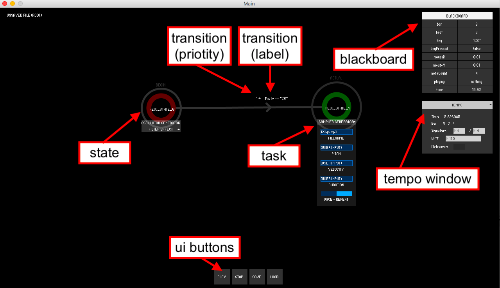

# Cheatsheet


This cheatsheet summarizes the most basic information you need to use the KeyStates. It is organized as follows:
* [State](#state);
* [Task](#task);
* [Blackboard](#blackboard);
    * [Visible](#visible);
    * [Hidden](#hidden);
* [Transitions](#transitions);
* [Tempo Window](#tempo-window);
* [UI Buttons](#ui-buttons).

In case you need further help, we have prepared [five video tutorials](https://www.youtube.com/watch?v=KFbYJglFdVA&list=PLtFNFbFuSLHGUVVX1v8A8FYhaTdlSDEcv) detailing different functionalities of our prototype. They are available on:
* [Tutorial 1: Getting started!](https://www.youtube.com/watch?v=KFbYJglFdVA&list=PLtFNFbFuSLHGUVVX1v8A8FYhaTdlSDEcv)
* [Tutorial 2: Tasks](https://www.youtube.com/watch?v=V-bdST6PN4I&list=PLtFNFbFuSLHGUVVX1v8A8FYhaTdlSDEcv&index=2)
* [Tutorial 3: The Blackboard](https://www.youtube.com/watch?v=rVEK4iP4Kmo&index=3&list=PLtFNFbFuSLHGUVVX1v8A8FYhaTdlSDEcv)
* [Tutorial 4: Transitions](https://www.youtube.com/watch?v=-hQYRDUVzsM&index=4&list=PLtFNFbFuSLHGUVVX1v8A8FYhaTdlSDEcv)
* [Tutorial 5: Meta tasks](https://www.youtube.com/watch?v=NULiXKwJn_M&index=5&list=PLtFNFbFuSLHGUVVX1v8A8FYhaTdlSDEcv).

Finally, if you have any specific question, do not hesitate to shoot me an email at:
```
jeronimo [dot] costa [at] mail [dot] mcgill [dot] ca
```

## State
Abstract entity that represents one particular configuration of the keyboard. Possible functionalities include:

| Action | Required interaction |
| ------------- | ------------- |
| Add new state | Move the mouse to an empty position on canvas and press the "+" key. |
| Edit state name | Click on a state, and retype its name. |
| Move state | Drag the state using the mouse.|
| Remove state | Move the mouse to a state and press the "-" key. |

## Task
Individual action that can happen inside a state (e.g. sound generators, augmenters, effects). Tasks are manipulated as follows:

| Action | Required interaction |
| ------------- | ------------- |
| Add new task | Move the mouse to a state name and right click on it |
| Edit task | Click on a task. Different high level properties are available depending on the task type. |
| Remove task | Move the mouse to a task and press the "-" key. |

## Blackboard
A repository of memory values (i.e. variables) that can be used anywhere inside KeyStates. These can be either _visible_ or _hidden_.

### Visible
The visible blackboard variables are (in alphabetical order):

| Name | Description |
| ------------- | ------------- |
| bar | Current bar as shown in the tempo window. |
| beat| Current beat as shown in the tempo window. |
| key | Last note played on the musical keyboard. |
| keyPressed | Shows if there is any key down on the musical keyboard. |
| mouseX | x-axis position of the mouse cursor. |
| mouseY | y-axis position of the mouse cursor. |
| noteCount | Current note count as shown in the tempo window. |
| playing | Shows in musical terms what is being currently played on the keyboard (eg. a note? a chord?). |
| time | Shows how much time has been passed since play button has been pressed. |

### Hidden
The hidden blackboard variables are (in alphabetical order):

| Name | Description |
| ------------- | ------------- |
| 'cc1' to 'cc12' | Stores values of MIDI control changes (CC) messages. |
| chord | Stores the last chord played on the musical keyboard. |
| interval | Stores the last interval played on the musical keyboard. |
| keyReleased | Shows if there is all keys are released on the musical keyboard. |
| minutes |Shows how many minutes have passed since execution started (from 0 to 60). |
| mousePressed | Shows if any mouse button is currently down. |
| note | Stores the last note played on the musical keyboard. |
| numKeyPresses | Stores how many keys are currently down on the musical keyboard. |
| pcKey | Last key to be pressed on the computer keyboard (not the musical keyboard). |
| pcKeyPressed | Shows if any key down on the computer keyboard (not the musical keyboard). |
| seconds | Shows how many seconds have passed since execution started (from 0 to 60). |

## Transitions
A logical condition that—if met—leads to the transition from one state to another.

| Action | Required interaction |
| ------------- | ------------- |
| Add new transition | Right click on the initial state and drag the transition towards the destination state. |
| Edit transition | Click on a transition label and retype the new condition (needs to be a logical expression). |
| Change priority | Click on the number on the side of the transition label and chose the new priority. |
| Remove transition | Move the mouse to a transition label and press the "-" key. |

## Tempo Window
Provides tempo control for the user. Possible controls are:

| Name | Description |
| ------------- | ------------- |
| Time | Shows how much time has been passed since play button has been pressed (as in Blackboard's time). |
| Bar | Shows current note count, beat, and bar. |
| Signature | Allows users to change the time signature of the current patch. |
| BPM | Allows users to change the Beats Per Minute (BPM) of the current patch. |
| Metronome | Enables/disables the sound of a metronome. |

## UI Buttons
Meta actions related to the flow of the state machine:

| Button | Description |
| ------------- | ------------- |
| Play | Executes the current state machine. |
| Stops| Stops the execution of the state machine. |
| Save | Saves the current state machine to a file. |
| Load | Loads a state machine from file. |
